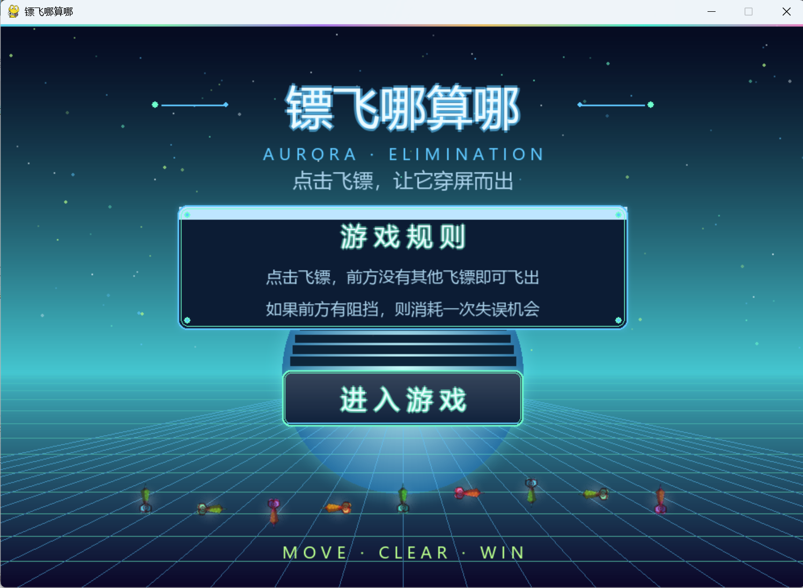
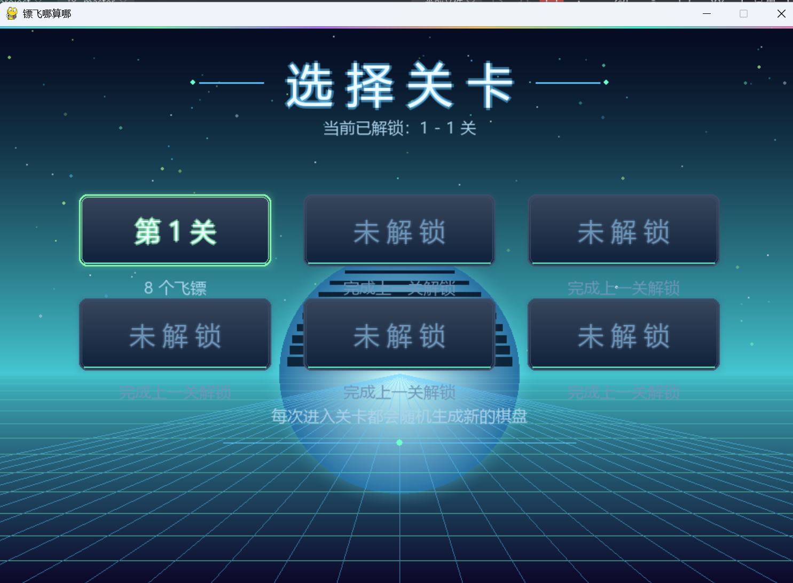
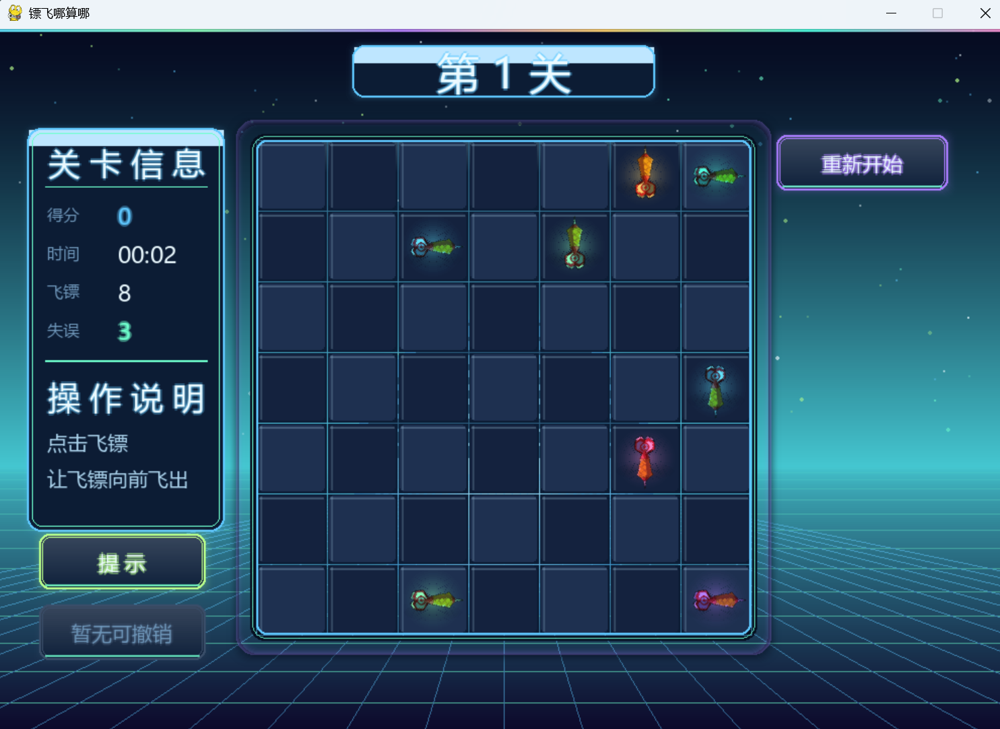
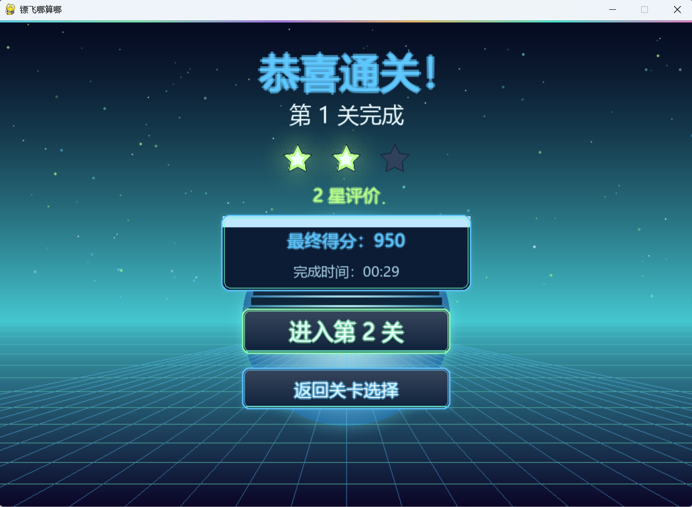
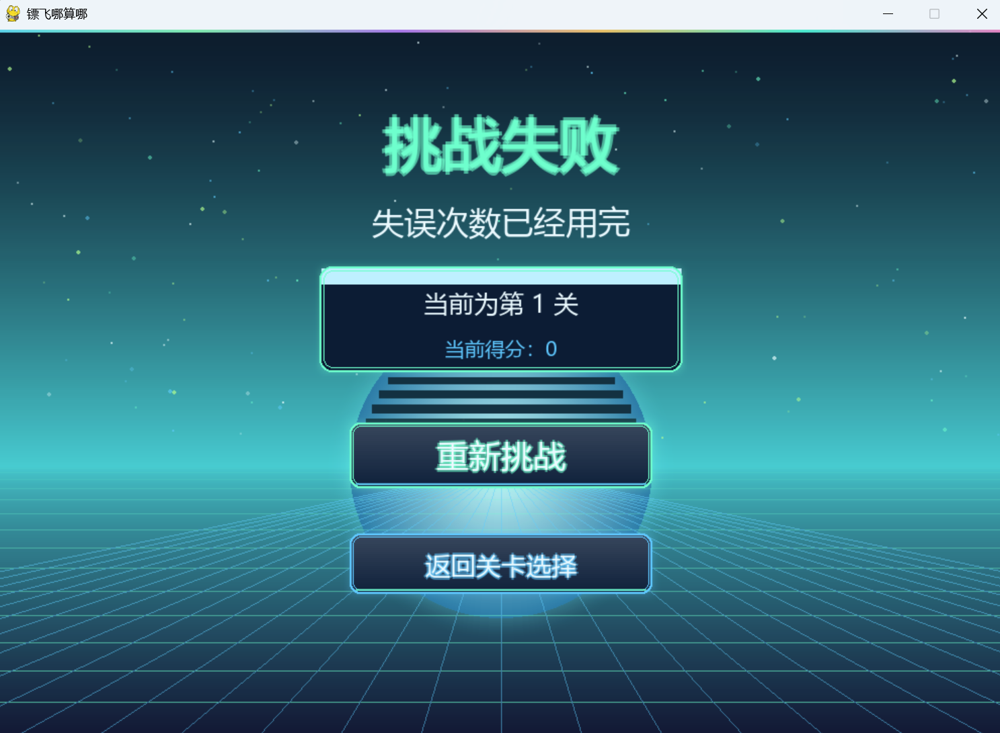

# 🎯镖飞哪算哪🎯

## 一、项目简介

本项目是一款基于 Python 和 Pygame 开发的休闲益智小游戏。

玩家需要观察棋盘上每个飞镖的方向，判断飞镖前进的路径上是否存在其他飞镖。如果前方没有阻挡，点击该飞镖后即可将其发射出棋盘；如果前方存在其他飞镖，则无法发射，并扣除一次失误次数。

玩家需要按照合理的顺序不断清除飞镖，直到棋盘上的所有飞镖全部消失，从而完成当前关卡。

游戏包含多个关卡，随着关卡推进，棋盘中的飞镖数量逐渐增加，游戏难度也会相应提高。

---

## 二、游戏特点

- 🎯 四方向飞镖：支持上、下、左、右四个方向。
- 🧩 路径检测：自动判断飞镖前方是否存在阻挡。
- ✈️ 飞出动画：成功点击后，飞镖会沿当前方向飞出棋盘。
- ❌ 碰撞反馈：点击被阻挡的飞镖时，会显示阻挡提示并扣除失误次数。
- ⭐ 关卡评价：根据通关时间和失误次数计算星级。
- 💯 游戏计分：成功消除飞镖可以获得分数，发生失误会扣分。
- 💡 提示功能：可以提示当前能够正常飞出的飞镖。
- ↩️ 撤销功能：可以撤销最近一次操作。
- 🔄 重新开始：可以重新开始当前关卡。
- 🎮 多关卡：目前包含 6 个可游玩的关卡。
- 🎲 随机棋盘：关卡棋盘中的飞镖位置和方向会随机生成，并进行可解性检测。

---

## 三、游戏规则

### 1. 飞镖发射

点击棋盘中的飞镖后，程序会检测该飞镖指向的方向。

如果飞镖前方直到棋盘边界都没有其他飞镖，则该飞镖可以正常飞出。

例如：

```text
● → → → 边界
```
### 2. 飞镖被阻挡

如果飞镖前方存在其他飞镖，则当前飞镖无法发射。

例如：
```
● → ● → 边界
```
第一个飞镖被第二个飞镖挡住，此时点击不会将其移除，并会消耗一次失误次数。
### 3. 通关条件

当棋盘上的所有飞镖都被成功清除后，当前关卡通关。

通关后会根据玩家的表现计算星级，并可以进入下一关。
### 4. 失败条件

如果玩家的失误次数耗尽，则当前关卡失败。

失败后可以重新开始当前关卡。
# 四、游戏界面

游戏主要包含以下几个界面：

### 1. 开始界面

开始界面显示游戏名称以及进入游戏按钮。

玩家点击进入游戏后，可以选择需要挑战的关卡。



### 2. 关卡选择界面

目前设置了 6 个关卡。

不同关卡具有不同数量的飞镖：



| 关卡 | 飞镖数量 | 失误次数 |
|:---:|:---:|:---:|
| 第1关 | 8 | 3 |
| 第2关 | 10 | 4 |
| 第3关 | 12 | 5 |
| 第4关 | 14 | 5 |
| 第5关 | 16 | 6 |
| 第6关 | 18 | 7 |

随着关卡提高，棋盘中的飞镖数量增加。

### 3. 游戏界面

游戏界面主要显示：

当前关卡
当前得分
通关时间
剩余飞镖数量
剩余失误次数
游戏棋盘
提示按钮
撤销按钮
重新开始按钮



### 4. 通关界面

成功清除当前关卡的全部飞镖后，会显示：

通关结果
通关时间
使用的失误次数
获得星级
当前得分
下一关按钮



### 5. 失败界面

当失误次数耗尽后，会进入失败界面，并提供重新开始当前关卡的功能。



# 五、开发环境
### 软件环境
Python 3.x  
PyCharm  
Pygame  
Git  
GitHub
本项目自带中文字体文件 shiweiyongchunheicuti.ttf，克隆仓库后无需额外安装字体即可运行。
### 主要开发语言
python  
### 使用的主要库
```
pygame
sys
math
os
time
copy
random
```
其中：  
**pygame**：负责游戏窗口、图形绘制、鼠标事件和动画。  
**random**：用于随机生成关卡。  
**time**：用于计算游戏时间。  
**copy**：用于保存撤销操作前的游戏状态。  
**os**：用于加载字体和游戏资源。  
**math**：用于部分位置和动画计算。  

# 六、运行方法
### 1. 安装 Python

确认电脑已经安装 Python 3.x。

可以在终端中输入：
python --version 查看python版本
### 2. 安装 Pygame
打开 PyCharm Terminal，输入：
```
pip install pygame
```
### 3. 下载项目

将项目下载或克隆到本地。

进入项目目录：
```
cd 项目目录
```
### 4. 运行游戏
运行：
```
python main.py
```
也可以直接在 PyCharm 中打开 main.py，点击运行按钮。

# 七、操作方式
| 操作   | 功能          |
| :--- | :---------- |
| 鼠标左键 | 点击飞镖        |
| 提示按钮 | 显示当前可以飞出的飞镖 |
| 撤销按钮 | 撤销最近一次操作    |
| 重新开始 | 重新开始当前关卡    |


